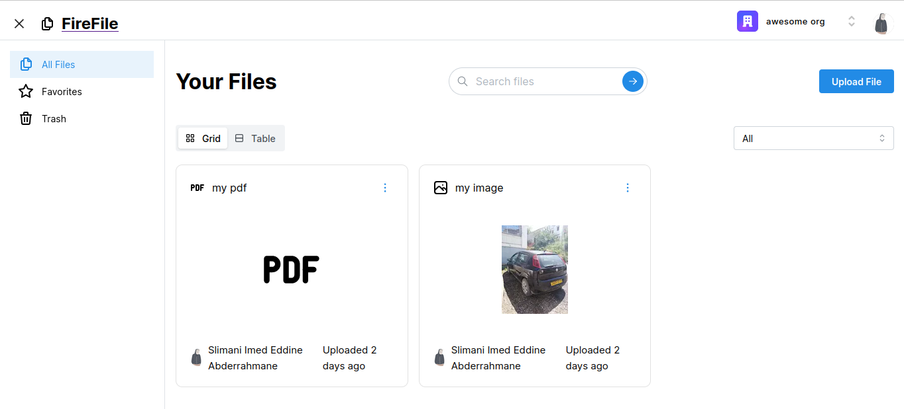

# [File Storage App](https://file-storage-app-peach.vercel.app/)

This is a file upload web app kind of like a mini version of google drive built with Next.js Pages Router for the client side and Convex for the backend.

[](https://file-storage-app-peach.vercel.app/)

## Tech Stack

- [Next.js](https://nextjs.org)
- [TypeScript](https://www.typescriptlang.org/)
- [Clerk](https://clerk.com/)
- [Mantine](https://mantine.dev/)
- [Convex](https://www.convex.dev/)
- [Tabler Icons](https://tabler.io/icons)
- [Zod](https://zod.dev/)
- [React Hook Form](https://react-hook-form.com/)
- [Mantine Datatable](https://icflorescu.github.io/mantine-datatable/)

## Features

- Sign In, Sign Up and Sign Out with Clerk
- UI components from Mantine styled with CSS Modules
- Zod for schema validation
- React Hook Form for handling forms
- Mantine Datatable for handling tables
- User Management with Clerk
- Create, update and remove organizations
- Add members to organization
- Decide roles of members of organization
- Upload files
- Mark files as favorite
- Move files to trash
- Restore files from trash
- Set a cron job to delete files permanently after a period of time
- Search file based on their names

## Running locally

### 1. Clone the repository

```bash
git clone https://github.com/slimanimeddine/file-storage-app
```

### 2. Install dependencies

```bash
npm install
```

### 3. Create a `.env.local` file

Create a `.env.local` file in the root directory and add the environment variables as shown in the `.env.example` file.

### 4. Run Convex

```bash
npx convex dev
```

### 5. Run Next.js

```bash
npm run dev
```

## How do I deploy this?

Follow the deployment guides [Convex](https://docs.convex.dev/production/hosting/), [Next.js](https://nextjs.org/docs/pages/building-your-application/deploying) for more information.
